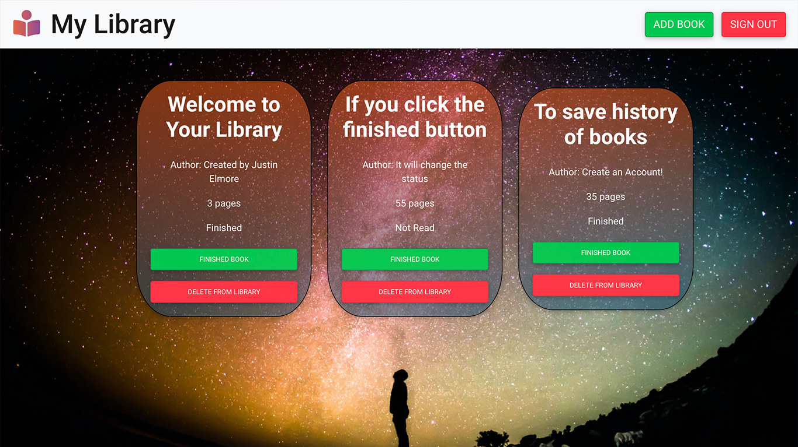

# Library App

## LINKS

[Visit Live Site](https://mylibrary.justinelmore.dev)

[Backend Repository](https://github.com/jelmore1674/MyLibraryReactFullStack/tree/main/mylibrary-backend)

## About

This is a updated library app of my previous one. This app is packed full of
features. User authentication, storage, and just a new spin on a previous app.

## Technologies

### Docker

The Entire App is containerized in a docker container. Using docker I was able
to create a easy to deploy web application.

### Nginx

Within the Docker container I am using NGINX to proxy the services so calling
the api's in the app is made easy.

### Front End

### Back End

